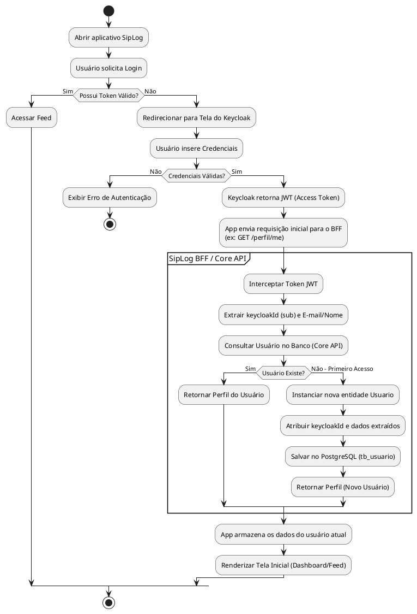

# Diagrama de Atividades: Autenticação e Sincronização (Primeiro Login)

Fluxo demonstrando como a arquitetura lida com usuários recém-registrados no Keycloak sendo sincronizados na base do SipLog (Core API).

