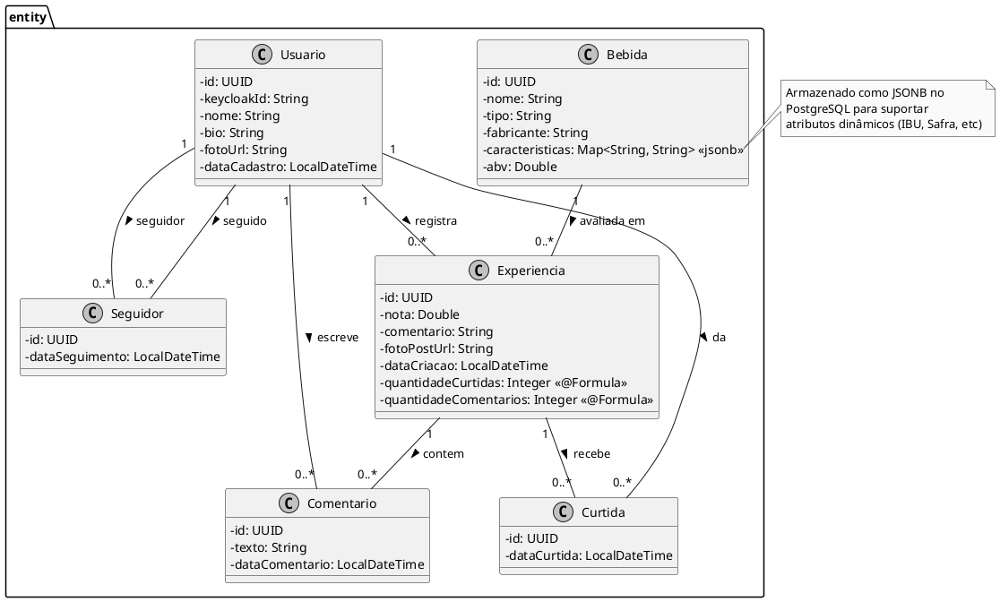

# Diagrama de Classes - SIP (Core API)

Este diagrama representa o modelo de domínio do back-end, focado no banco de dados relacional PostgreSQL da Core API.

```plantuml
@startuml
skinparam classAttributeIconSize 0
skinparam monochrome true
skinparam shadowing false

package "entity" {

    class Usuario {
        - id: UUID
        - keycloakId: String
        - nome: String
        - bio: String
        - fotoUrl: String
        - dataCadastro: LocalDateTime
    }

    class Bebida {
        - id: UUID
        - nome: String
        - tipo: String
        - fabricante: String
        - caracteristicas: Map<String, String> <<jsonb>>
        - abv: Double
    }

    class Experiencia {
        - id: UUID
        - nota: Double
        - comentario: String
        - fotoPostUrl: String
        - dataCriacao: LocalDateTime
        - quantidadeCurtidas: Integer <<@Formula>>
        - quantidadeComentarios: Integer <<@Formula>>
    }

    class Seguidor {
        - id: UUID
        - dataSeguimento: LocalDateTime
    }

    class Curtida {
        - id: UUID
        - dataCurtida: LocalDateTime
    }

    class Comentario {
        - id: UUID
        - texto: String
        - dataComentario: LocalDateTime
    }

    ' Relacionamentos
    Usuario "1" -- "0..*" Experiencia : registra >
    Bebida "1" -- "0..*" Experiencia : avaliada em >
    
    Usuario "1" -- "0..*" Seguidor : seguidor >
    Usuario "1" -- "0..*" Seguidor : seguido >
    
    Usuario "1" -- "0..*" Curtida : da >
    Experiencia "1" -- "0..*" Curtida : recebe >
    
    Usuario "1" -- "0..*" Comentario : escreve >
    Experiencia "1" -- "0..*" Comentario : contem >
}

note right of Bebida::caracteristicas
  Armazenado como JSONB no 
  PostgreSQL para suportar
  atributos dinâmicos (IBU, Safra, etc)
end note

@enduml
```