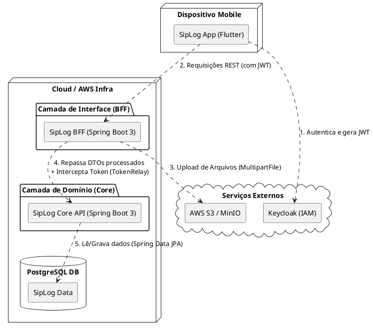

# Diagrama de Componentes - Infraestrutura e Microsserviços

Visão geral dos módulos de software e provedores externos de serviço (Keycloak e AWS).

```plantuml
@startuml
skinparam componentStyle rectangle

node "Dispositivo Mobile" {
    [SipLog App (Flutter)] as App
}

node "Cloud / AWS Infra" {
    
    package "Camada de Interface (BFF)" {
        [SipLog BFF (Spring Boot 3)] as BFF
    }

    package "Camada de Domínio (Core)" {
        [SipLog Core API (Spring Boot 3)] as CoreAPI
    }

    database "PostgreSQL DB" {
        [SipLog Data] as DB
    }
}

cloud "Serviços Externos" {
    [Keycloak (IAM)] as Keycloak
    [AWS S3 / MinIO] as S3
}

' Relações
App ..> Keycloak : 1. Autentica e gera JWT
App ..> BFF : 2. Requisições REST (com JWT)
BFF ..> S3 : 3. Upload de Arquivos (MultipartFile)
BFF ..> CoreAPI : 4. Repassa DTOs processados \n+ Intercepta Token (TokenRelay)
CoreAPI ..> DB : 5. Lê/Grava dados (Spring Data JPA)

@enduml
```