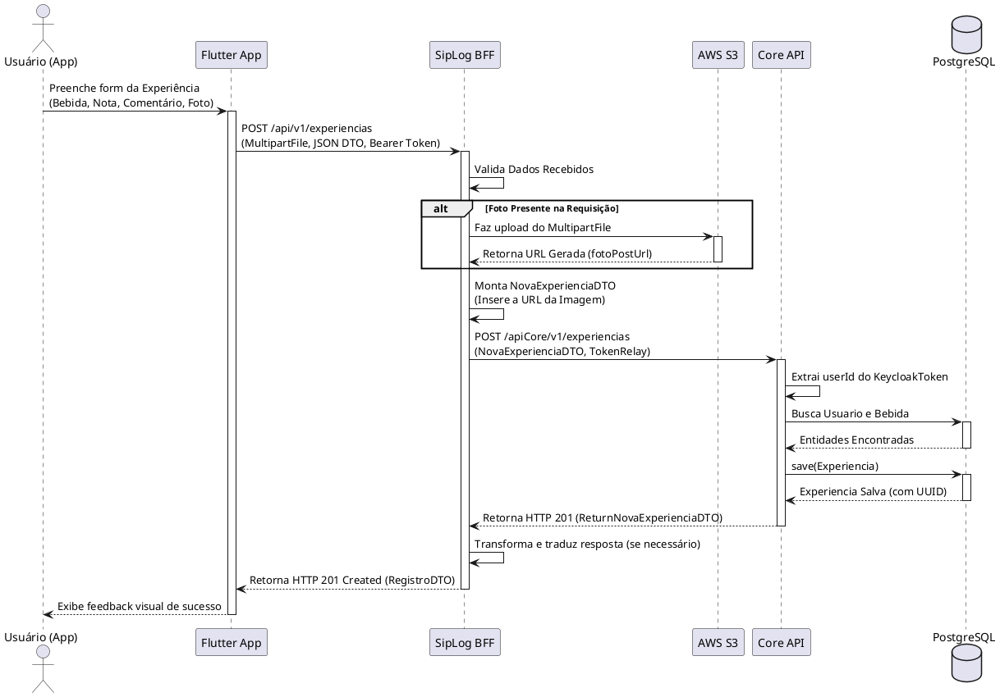

# Diagrama de Sequência: Postar Nova Experiência com Imagem

Fluxo detalhado demonstrando o App comunicando com o BFF, que orquestra o upload da imagem e encaminha os metadados para a Core API.

```plantuml
@startuml
actor "Usuário (App)" as User
participant "Flutter App" as App
participant "SipLog BFF" as BFF
participant "AWS S3" as S3
participant "Core API" as Core
database "PostgreSQL" as DB

User -> App: Preenche form da Experiência\n(Bebida, Nota, Comentário, Foto)
activate App

App -> BFF: POST /api/v1/experiencias\n(MultipartFile, JSON DTO, Bearer Token)
activate BFF

BFF -> BFF: Valida Dados Recebidos

alt Foto Presente na Requisição
    BFF -> S3: Faz upload do MultipartFile
    activate S3
    S3 --> BFF: Retorna URL Gerada (fotoPostUrl)
    deactivate S3
end

BFF -> BFF: Monta NovaExperienciaDTO \n(Insere a URL da Imagem)

BFF -> Core: POST /apiCore/v1/experiencias\n(NovaExperienciaDTO, TokenRelay)
activate Core

Core -> Core: Extrai userId do KeycloakToken
Core -> DB: Busca Usuario e Bebida
activate DB
DB --> Core: Entidades Encontradas
deactivate DB

Core -> DB: save(Experiencia)
activate DB
DB --> Core: Experiencia Salva (com UUID)
deactivate DB

Core --> BFF: Retorna HTTP 201 (ReturnNovaExperienciaDTO)
deactivate Core

BFF -> BFF: Transforma e traduz resposta (se necessário)
BFF --> App: Retorna HTTP 201 Created (RegistroDTO)
deactivate BFF

App --> User: Exibe feedback visual de sucesso
deactivate App
@enduml
```