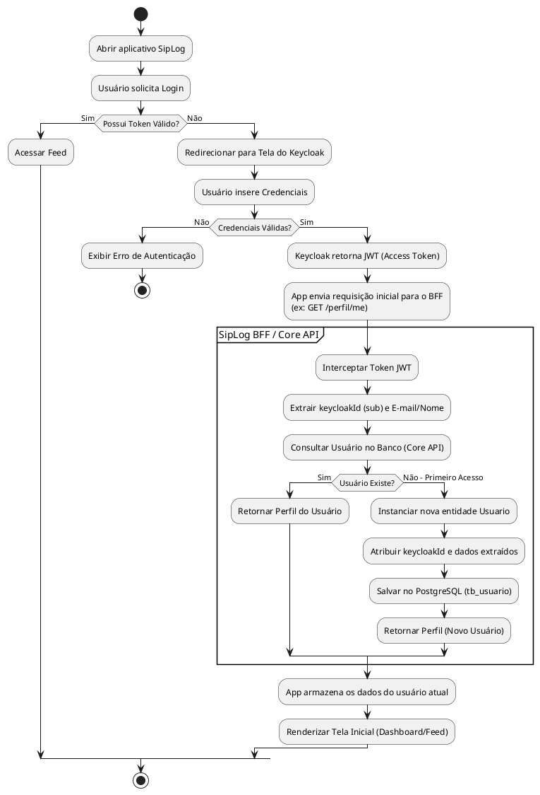
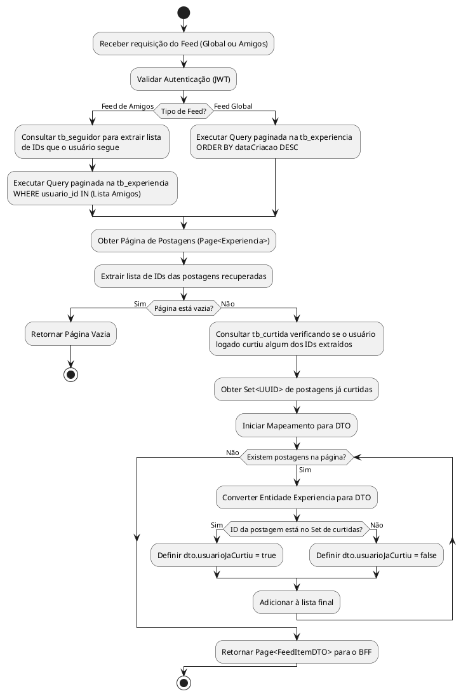

# Diagrama de Atividades: Autenticação e Sincronização (Primeiro Login)

Fluxo demonstrando como a arquitetura lida com usuários recém-registrados no Keycloak sendo sincronizados na base do SipLog (Core API).

# Diagrama de Atividades: Geração do Feed na Core API

Detalha o processo interno e de otimização de banco de dados (`FeedService`) executado pela Core API antes de devolver as postagens.

