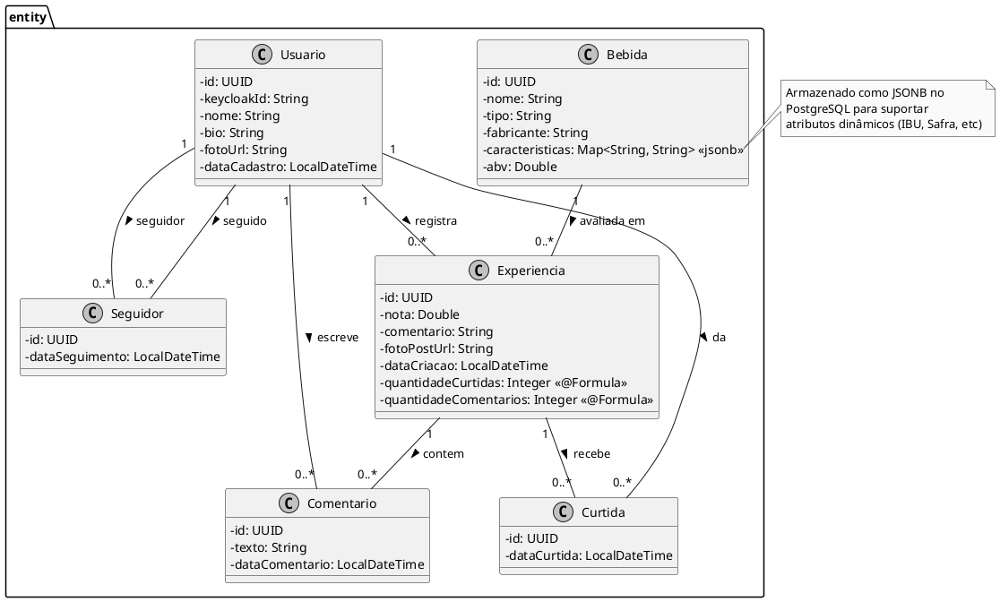
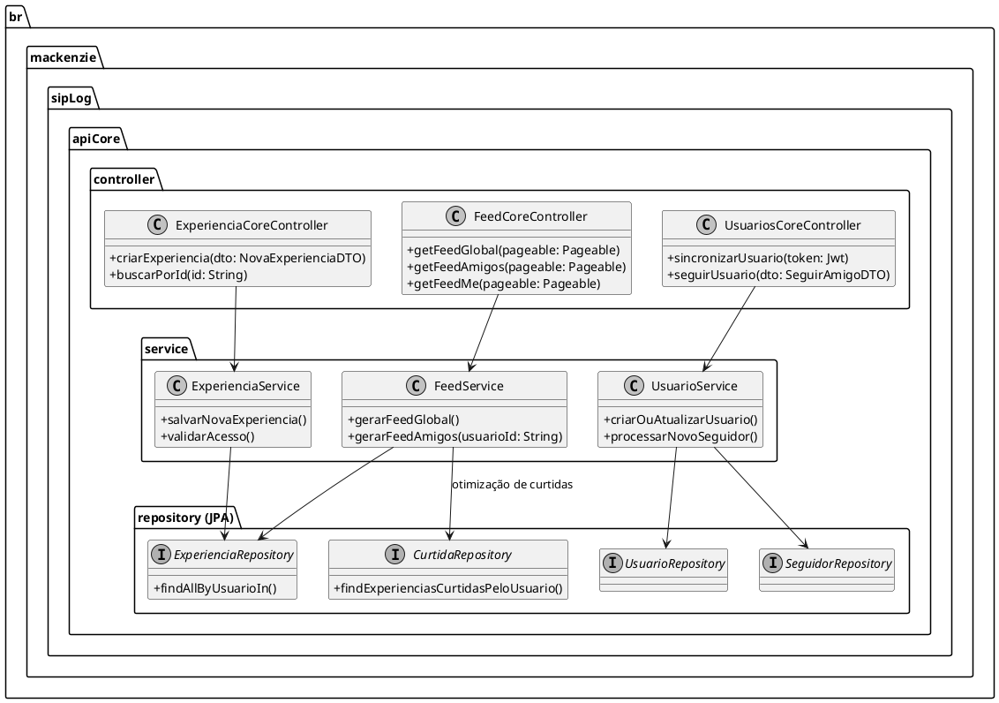
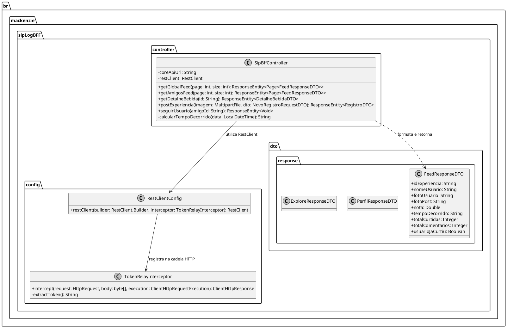

# Diagrama de Classes - SIP (Core API)

Este diagrama representa o modelo de domínio do back-end, focado no banco de dados relacional PostgreSQL da Core API.

# Diagrama de Classes - Core API (Controllers e Services)

Exibe as camadas lógicas da Core API, demonstrando como os Controllers delegam as regras de negócio aos Services, que por sua vez acessam os Repositórios.

# Diagrama de Classes - SipLog BFF

Este diagrama apresenta a estrutura interna do BFF, responsável por receber requisições do App, interceptar os tokens JWT do Keycloak e formatar as respostas para a interface mobile.

