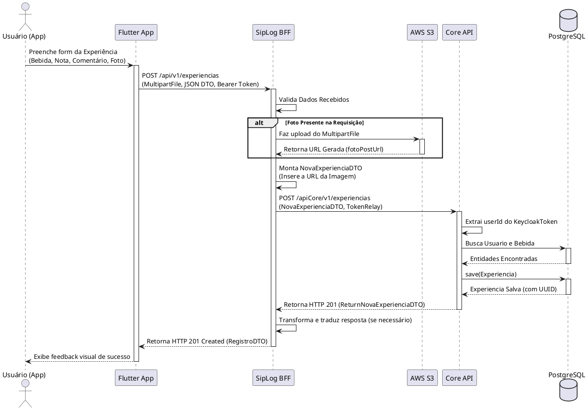
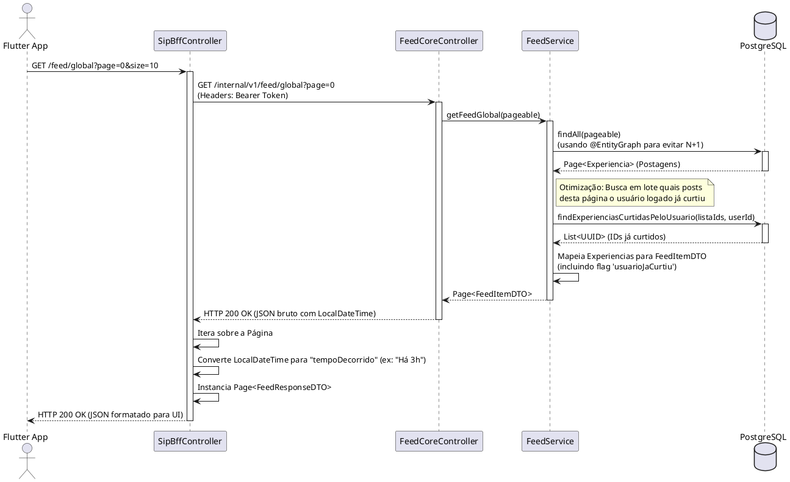
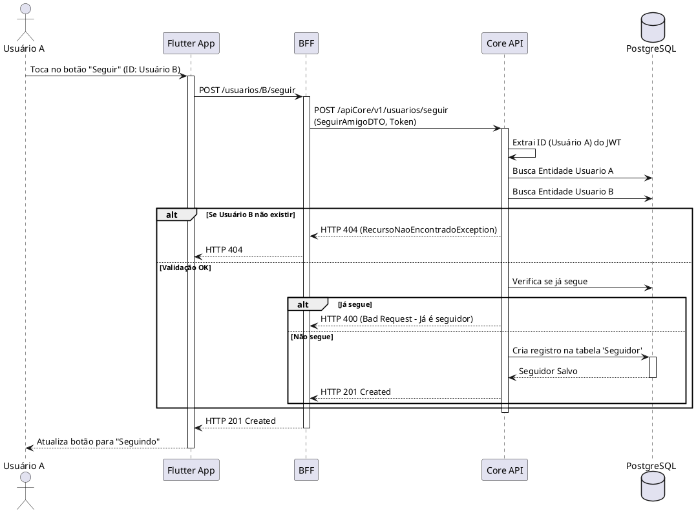

# Diagrama de Sequência: Postar Nova Experiência com Imagem

Fluxo detalhado demonstrando o App comunicando com o BFF, que orquestra o upload da imagem e encaminha os metadados para a Core API.

# Diagrama de Sequência: Carregamento do Feed Global

Fluxo mostrando como o Flutter solicita o feed, como o BFF repassa a requisição e como a Core API utiliza as otimizações do banco de dados (JPA/Hibernate) para devolver os dados.

# Diagrama de Sequência: Ação de Seguir Usuário

Demonstra o fluxo da rede social onde o Usuário A (Logado) decide seguir o Usuário B (Amigo).

